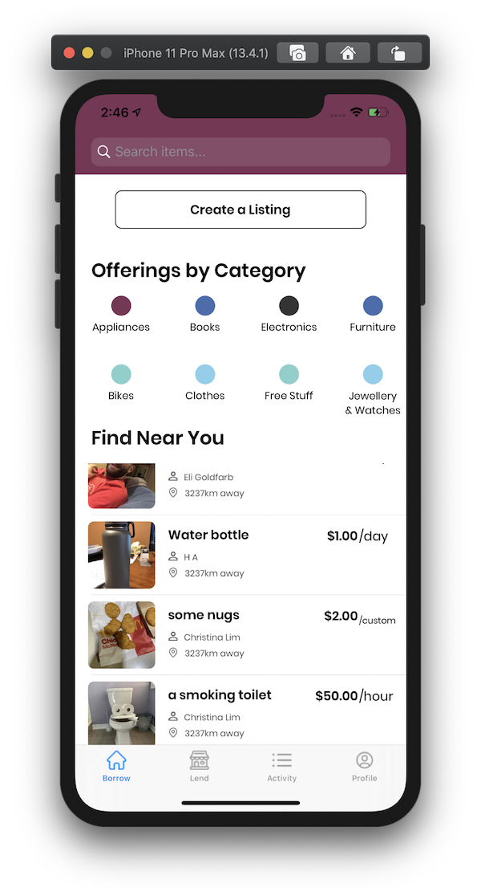
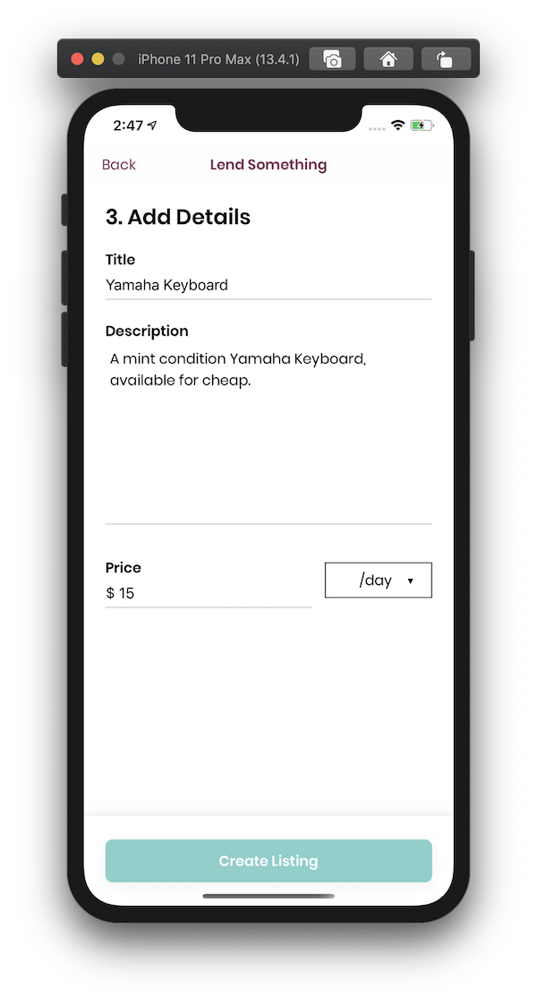
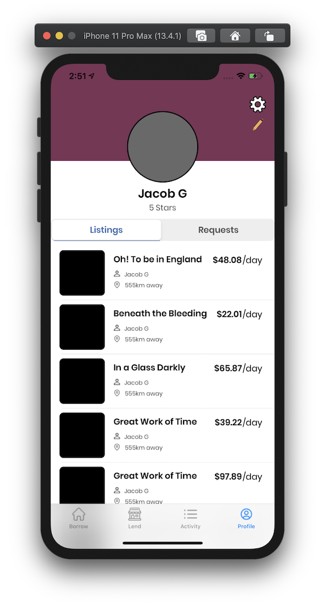
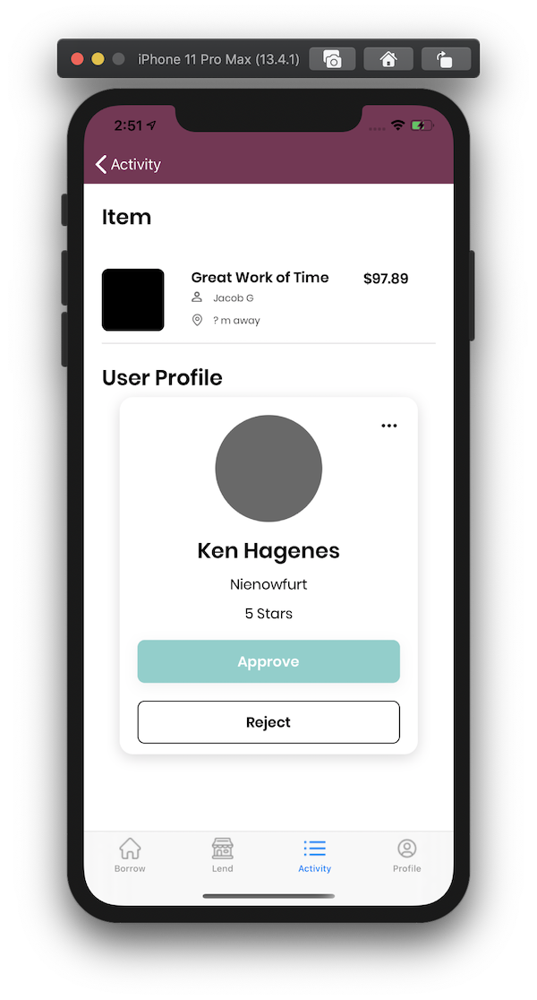
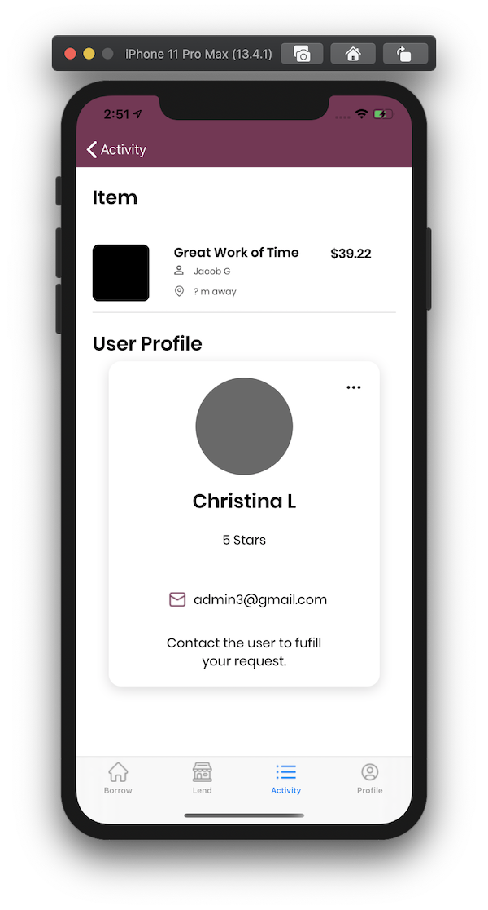
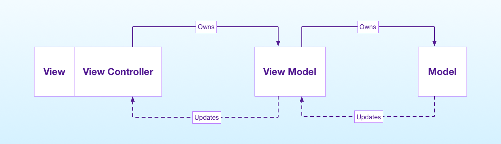

# Lender

## Screenshots

## Structure

### Brief
The project is structures by responsiblity as opposed to function. This means  views, view controllers, and models, etc. are not placed in different respective directories. Rather, groups are created based on responsiblity. In general, each group contains a view, view controller, view model, and service to encompass each layer of the app.

The goal of this is to app updates localized to each individual group and minimalize the area of the codebase which must be modified.

### Common/Components
In this directory lives various UI components which have been subclassed to have been stylizied according to the design language. 

## Class Types

### View Controllers
Most view controllers are kept relatively small by encapsulating much of the view setup in each respective view class, and the business logic in the view model class.

View controllers usally hold the following properties:
1. `nameView: NameView` - reference to the view replaces the view controllers native `view`
2. `nameViewModel: NameViewModel`

In general, view controllers consist of the follow methods:
1. `loadView` - where the view controller's `view` is replaced with `nameView`
2. `viewDidLoad`
3. `setupViewModel` - where the view model is initialized. Not present if the view model is injected.
4. `setupView` - responsible for tweaks and stylizing `nameView`

### Views
In general, views consist of the following methods:
1. `setupView` - responsible for changing properties of the view, including the background color.
2. `setupSubviews` - responsible for calling methods which stylize each subview, and adds each subview to the superview.
3. `setupConstraints` - responsible for calling methods which setup constraints for all subviews.

### Models
Models encapsulate various business items used throughout the app. They are also codable for easy transportation between frontend and backend.

### View Models
Despite the name, the view model does not have much to do with configuring the actual view owned by each view controller.  Also, despite the following digram, the view model also owns the networking service structures.

The View Model :
1. Is owned by a view controller
2. Holds reference to one or more model arrays or models, dependent on the view model purpose.
3. Owns utlity and business logic methods used by the view controller to format primitive types.
4. Communicates with the view controller through a ViewModelDelegate delegate.
5. Holds reference to a Service which encapsualtes the networking layer.
6. Communicates with the service through callback functions.

## Dependencies

1. Alamofire - Networking layer
2. IQKeyboardManager - Automatic keyboard management on text  component manipulation
3. Fakery - Generates fake data for testing
4. SnapKit - Handles constraints
5. SVProgressHUD - Handles loading indicator UI

## Terminology

- **Request** : a posting created to advertise the need for some item.
- **Rental**: a posting created to advertise some item is available to rent.
- **Item**: A posting, either a rental or a request
- **Market Item**: An item available on the market. It is not owned the the primary user.
- **Bidded Market Item**: An item listed on the market that has been bidded on by the primary user.
- **Post**: An item that is owned the the primary user.
- **Bid**: A plea to fufill someone's request, or to consume a rental.
- **Approval**: The accepting of a bid.
- **Market**: The subset of items that are available to rent (i.e., have status "available"). 
